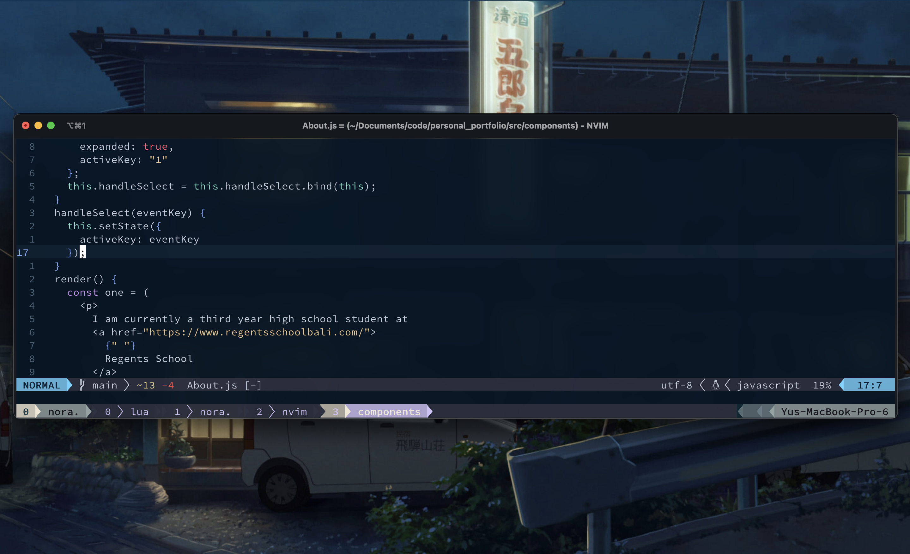
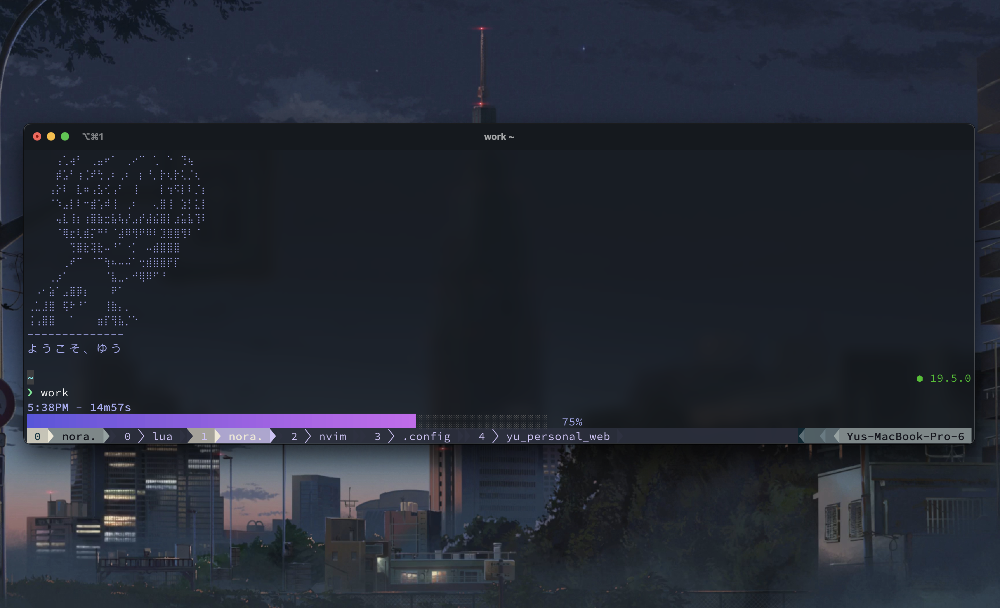

# Yu's dotfiles

Note: Don't blindly use the setting! Make sure you understand what it does.

## Contents

- Vim (NeoVim)
- Tmux 
- Git
- Fish

## Essentials

- [iTerm2](https://iterm2.com/)
- [Nerd Font](https://www.nerdfonts.com/) - Hack
- [Nvim](https://neovim.io/) (>= 0.8)
- [fish](https://fishshell.com/)

If you're on mac, you can install iTerm2, Neovim, and fish using [homebrew](https://brew.sh/).

<pre>brew install --cask iterm2</pre>
<pre>brew install neovim</pre>
<pre>brew install fish</pre>

## Neovim setup
- [wbthomason/packer.nvim](https://github.com/wbthomason/packer.nvim) - Plugin manager for Nvim
- [svrana/neosolarized.nvim](https://github.com/svrana/neosolarized.nvim) - Truecolor, solarized dark colorscheme
- [nvim-lualine](https://github.com/nvim-lualine/lualine.nvim) - Neovim statusline

## Shell setup

- [Fish shell](https://fishshell.com/)
- [Fisher](https://github.com/jorgebucaran/fisher) - Plugin manager 
- [Tide](https://github.com/IlanCosman/tide) - Shell theme. Version 5: `fisher install ilancosman/tide@v5`
- [Nerd fonts](https://github.com/ryanoasis/nerd-fonts) - Hack font
- [z for fish](https://github.com/jethrokuan/z) - Directory jumping
- [Exa](https://the.exa.website/) - `ls` replacement
- [peco](https://github.com/peco/peco) - Interactive filtering

## Resources

- Dotfiles was managed using [GNU Stow](https://www.gnu.org/software/stow/). 
- Creds to [@devaslife](https://www.youtube.com/@devaslife) for the configs!